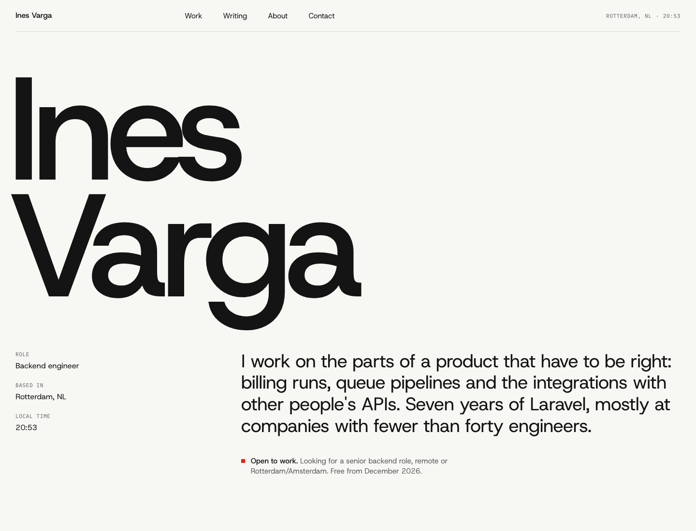
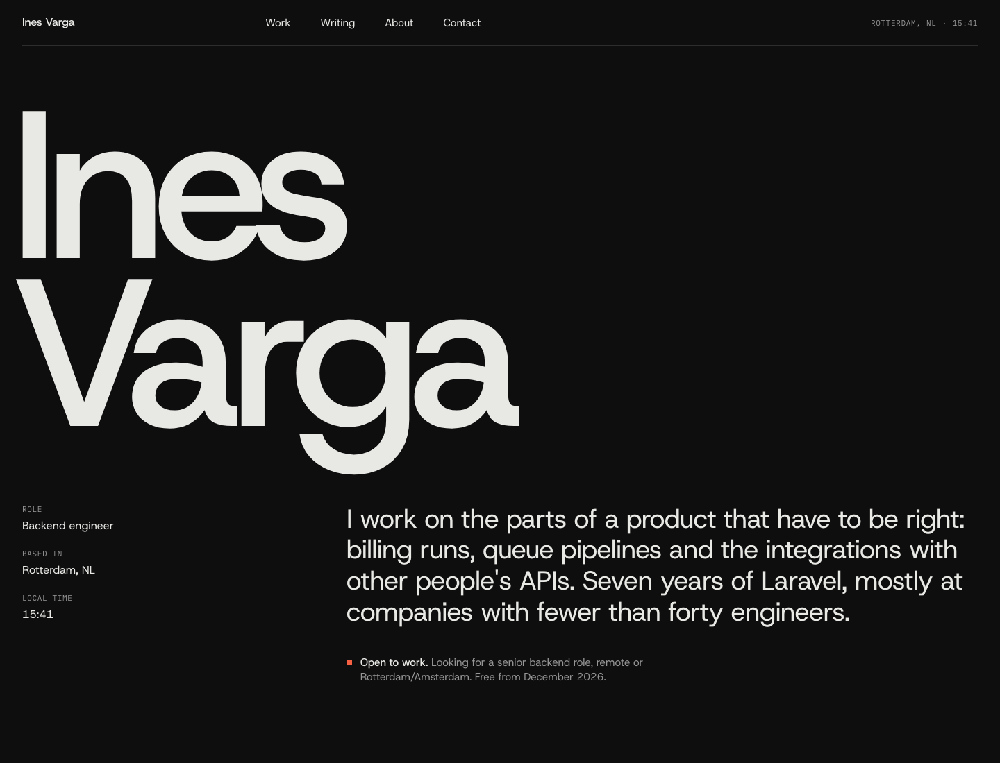

# Portfolio

A personal site for developers who are looking for work. Clone it, replace the
sample content with your own, and deploy it to [Laravel Cloud](https://cloud.laravel.com).

Built on Laravel 13, Inertia 3, React 19, Tailwind CSS 4 and shadcn/ui.

**[See the demo →](https://portfolio-template.laravel.cloud)**

| Light                                                                                     | Dark                                                                                   |
| ----------------------------------------------------------------------------------------- | -------------------------------------------------------------------------------------- |
| [](.github/assets/home-light.png) | [](.github/assets/home-dark.png) |

- **No database.** One YAML file holds your profile, and each project and post is a Markdown file. There's no admin panel, nothing to provision and nothing to log into.
- **Pages:** home, work index with case studies, writing with an RSS feed, about (experience, skills, education, résumé download) and contact.
- **Contact form:** messages are emailed to you through Resend, with Reply-To set to the sender. It has a honeypot and a rate limit. If sending fails, the visitor is told to email you directly, so no message silently disappears.
- **Built for scale-to-zero.** Nothing runs on a timer and there's no database to keep awake, so the app sleeps when nobody is visiting.
- **Server-side rendered** with Inertia SSR, so recruiters, search engines and link previews see real HTML with the right title and description.
- Light and dark themes, a sitemap, and a clock showing your local time.

---

## Get your copy

1. Click **Use this template → Create a new repository** at the top of this page. You get your own repository without this one's history.
2. Clone it and run it locally. You'll need PHP 8.3+, Composer and Node 22+. No database is needed.

```sh
git clone https://github.com/<you>/<your-repo>.git && cd <your-repo>
composer setup      # installs dependencies, creates .env, builds assets
composer run dev    # http://localhost:8000
```

3. Replace the sample content ([Make it yours](#make-it-yours)) and push.

## Make it yours

Everything you'll edit is in `content/`, `public/` and one CSS file.

| File                    | What it controls                                                                                              |
| ----------------------- | ------------------------------------------------------------------------------------------------------------- |
| `content/site.yaml`     | Name, role, location, time zone, email, availability, links, intro, about text, experience, skills, education |
| `content/projects/*.md` | One case study per file. The file name becomes the URL (`/work/invoice-sync`)                                 |
| `content/posts/*.md`    | One post per file. The file name becomes the URL (`/writing/my-post`)                                         |
| `public/resume.pdf`     | The résumé download. Set `resume: null` in `site.yaml` to hide the link                                       |
| `public/favicon.svg`    | Tab icon                                                                                                      |
| `resources/css/app.css` | The four colour tokens at the top: `--paper`, `--ink`, `--graphite` and `--signal` (the accent)               |
| `vite.config.ts`        | Fonts (Host Grotesk and IBM Plex Mono, served from Bunny Fonts)                                               |

### Project front matter

```yaml
---
title: Carrier invoice sync
summary: One sentence with a number in it. Shown in lists and link previews.
year: 2024
role: Lead engineer
stack: [Laravel, SQS]
featured: true # show on the home page
order: 1 # lower comes first
image: /images/sync.png # optional, put the file in public/images
image_alt: Dashboard showing dispute counts
links:
    - label: GitHub
      url: https://github.com/you/project
---
```

### Post front matter

```yaml
---
title: What I learned moving a queue off cron
summary: Shown in lists, the RSS feed and link previews.
date: 2026-05-12
draft: true # visible locally, hidden in production
---
```

Code blocks are highlighted on the server (PHP, JS/TS, CSS, HTML, SQL, YAML and more), so no highlighting JavaScript is sent to the browser.

Changes to `content/` show up on the next page load, locally and after each deploy.

---

## Development

```sh
composer test        # lint, PHPStan and Pest
npm run check        # Oxlint and format check
npm run types:check  # TypeScript
```

The tests read fixture content from `tests/Fixtures/content`, so editing your own content never breaks them.

The project ships with [Laravel Boost](https://laravel.com/docs/boost). Run `php artisan boost:install` to give your AI agent the project's guidelines, skills and MCP tools.

## Structure

```
app/Content/Portfolio.php      reads and caches everything in content/
app/Http/Controllers/          one small controller per page
content/                       your site
resources/css/app.css          design tokens and prose styles
resources/js/components/       layout pieces (section, project list, header, footer)
resources/js/components/ui/    shadcn/ui primitives
resources/js/pages/            one file per page
```

## License

[MIT](LICENSE). Remove the sample content (Ines Varga is not a real person) before you publish.
